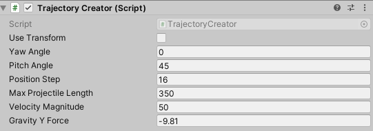
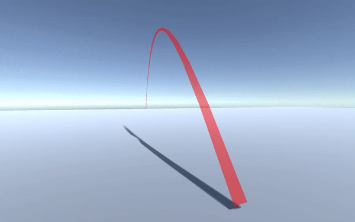

# Projectile3D
Simple trajectory creator for projectile motion with line renerer in Unity. Example project developed in Unity 2020.3.30f1. You can just grab "TrajectoryCreator.cs" script inside Assets/Scripts folder or download and check SampleScene.

# How To Use
1. Create empty game object.
2. Assign TrajectoryCreator.cs component to it.
3. Assign a material to automatically created line renderer. (Otherwise it will be pink)
4. Start the scene. Default trajectory will be created.

Trajectory settings:

Sample trajectory visual:

